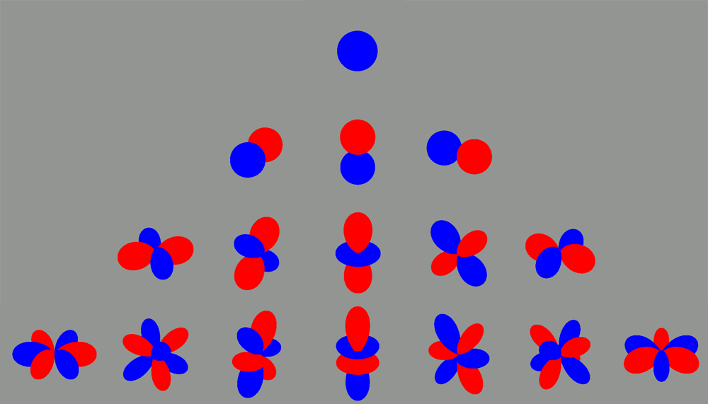

Real spherical harmonics basis functions, rows represents the degree, columns the order. Represented in spherical coordinates where the radius is the basis function value. 

$~$

$~$

*Disclaimer: The following proofs are not rigorous and skip over important steps to make the post easier to read. Full proofs can be found online.*

# Table of Contents

1. [Summary](#summary)
2. [Definition](#def)
3. [Properties](#prop)
    1. [Orthogonality](#ortho)
    2. [Expansion](#exp)
4. [Complex and Real Forms](#complex)
5. [Visualizations](#visual)
6. [Tables](#tables)
    1. [Associated Legendre Polynomials](#ALP)
    2. [Complex Spherical Harmonics](#CSH)
    3. [Real Spherical Harmonics](#RSH)

# Summary 

This is part 1 in a series about spherical harmonics and their uses in rendering. This post will focus on the definition and properties of spherical harmonics basis functions. We will define a normalized version of spherical harmonics, show they form a basis and establish that they can approximate functions over the sphere. 

# Definition  

By [solving Laplace's equation](https://beatthezombie.github.io/laplace_equation_solution/) we found that the angular part is:

$$
Y_{\ell}^{m}(\theta, \varphi) = P_\ell^m(\cos\theta)e^{im\varphi}
$$

Where $\ell, m$ are integers, $\ell\geq 0$ and $-\ell \leq m \leq \ell$ and $P_{\ell}^{m}$ is the associated Legendre polynomial. $\ell$ is called the degree (also bands) and $m$ the order of the spherical harmonic $Y_\ell^m$. We will not be directly using the solution above as it lacks a normalizing constant. To arrive at the final definition, we need to normalze $Y_{\ell}^{m}(\theta, \varphi)$. Using the $L_2$ inner product, it's possible to show that:

$$
\langle Y_{\ell}^{m},Y_{\ell}^{m}   \rangle = \int_{0}^{2\pi} \int_{0}^{\pi} Y_{\ell}^{m} (\theta, \varphi)^2 \sin \theta d\theta d\varphi = \frac{4\pi}{2\ell + 1} \frac{(\ell + m)!}{(\ell - m)!}
$$

Proving the statement above requires the inner product of the complex exponential and associated Legendre polynomial. When taking the square root we get the norm:

$$
|| Y_{\ell}^{m} || = \sqrt{ \frac{4\pi}{2\ell + 1} \frac{(\ell + m)!}{(\ell - m)!}}
$$

Now that we have the norm, let's define $Y_{\ell}^{m}$ as:

$$
Y_{\ell}^{m}(\theta, \varphi) = (-1)^{m} \sqrt{ \frac{2\ell + 1}{4\pi} \frac{(\ell - m)!}{(\ell + m) }} P_\ell^m(\cos\theta)e^{im\varphi}
$$

The term $(-1)^{m}$ is called Condon-Shortley phase and is used by convention in physics to simplify some equations. This definition is valid for $\ell \geq 0$, $-\ell \leq m \leq \ell$, having a special case for negative $m$ values:

$$
Y_{\ell}^{-m}(\theta, \varphi) = (-1)^m (Y_{\ell}^{m}(\theta, \varphi))^*
$$

This can be shown using this equation from the associated Legendre polynomials:

$$
P_\ell^{-m}(x) = (-1)^m \frac{(\ell-m)!}{(\ell+m)!}P_\ell^m(x)
$$

And the facts that the complex conjugate of real functions is identity and $(e^{im\varphi})^* = e^{-im\varphi}$.

# Properties 

## Orthogonality 

For fixed $m$, with the $L_2$ inner product we have:

$$
\langle Y_{\ell}^{m},Y_{\ell'}^{m}   \rangle = \int_{0}^{2\pi} \int_{0}^{\pi} Y_{\ell}^{m} (\theta, \varphi) Y_{\ell'}^{m}  (\theta, \varphi) \sin \theta d\theta d\varphi = \delta_{\ell \ell'}
$$

Where $\delta_{\ell \ell'}$ is the Kronecker delta function, being 0 when $\ell \neq \ell'$ and 1 when $\ell = \ell'$.  and relies on the orthogonality of the Legendre polynomials and the complex exponential. When $\ell = \ell'$ we get back the inner product which is 1 after normalizing the spherical harmonics definition. 

If we consider the case when $m$ is not fixed, we can show that the complex exponential is orthogonal (using the complex version of the $L_2$ inner product):

$$
\int_{0}^{2\pi} (e^{im\varphi})^*e^{im'\varphi} d\varphi = 2\pi \delta_{m m'}
$$

When $m=m'$, the numerator vanishes and the result is $2\pi$, otherwise it cancels out to 0. Combining this with the previous result we get the orthogonality for both $m$ and $\ell$:

$$
\langle Y_{\ell}^{m},Y_{\ell'}^{m'}   \rangle = \int_{0}^{2\pi} \int_{0}^{\pi} Y_{\ell}^{m} (\theta, \varphi) Y_{\ell'}^{m'}  (\theta, \varphi) \sin \theta d\theta d\varphi = \delta_{\ell \ell'} \delta_{m m'}
$$

Since the norm of $Y_{\ell}^{m}$ is 1, they are also orthonormal. A more rigorous proof of orthogonality can be found [here](https://www.physics.uoguelph.ca/chapter-4-spherical-harmonics).

## Expansion 

Since $Y_\ell^m$ forms a set of orthonormal functions, they can be used to expand functions as a linear combination of spherical harmonics as follows:

$$
f(\theta, \varphi) = \sum_{\ell = 0}^{\infty} \sum_{m=-\ell}^{\ell} f_\ell^m Y_\ell^m(\theta, \varphi)
$$

Where $f_\ell^m \in \mathbb{C}$ are the basis function coefficients. This holds for functions $f$ that are square-integrable on $S^2$, meaning that the integral of $\lvert f^2 \rvert$ is finite. The coefficients can be found by integrating the product of the complex conjugate of $Y_\ell^m$ and $f$ over the sphere. The [Wikipedia entry](https://en.wikipedia.org/wiki/Spherical_harmonics#Spherical_harmonics_expansion) for spherical harmonics has more details on how it works. 

This expansion property also holds for real spherical harmonics, and it guarantees that the coefficients $f_\ell^m$ are in $\mathbb{R}$ instead of $\mathbb{C}$.

There are many more properties (eg. rotation, parity) about spherical harmonics and I will try to explore them in details in future posts

$~$

# Complex and Real Forms 

The definition of the spherical harmonics above is from the surface of the sphere to the complex numbers: 

$$Y_{\ell}^{m}: S^2 \rightarrow \mathbb{C}$$

Where $S^2$ is the surface of the sphere defined with $\theta\in [0, \pi]$ and $\varphi \in [0, 2\pi]$. If we want to map to the real numbers, we need an different definition. Let $Y_{\ell m}: S^2 \rightarrow \mathbb{R}$ be the real spherical harmonics with the following definition:

$$
Y_{\ell m} = 
\begin{cases}
\frac{i}{\sqrt{2}}\left( Y_{\ell}^{m} - (-1)^m Y_{\ell}^{-m}  \right), & \mbox{if } m < 0 \\ 
Y_{\ell}^{0}, & \mbox{if } m = 0 \\
\frac{i}{\sqrt{2}}\left( Y_{\ell}^{-m} + (-1)^m Y_{\ell}^{m}  \right), & \mbox{if } m > 0 
\end{cases}
$$

We can expand this definition in terms of the associated Legendre polynomials and trigonometric functions.

$$
Y_{\ell m} = 
\begin{cases}
\sqrt{2} \sqrt{\frac{2\ell + 1}{4 \pi} \frac{ (\ell - |m|)!}{(\ell + |m|)!}} P_{\ell}^{|m|}
(\cos \theta) \sin (|m|\varphi), & \mbox{if } m < 0 \\ 

Y_{\ell}^{0}, & \mbox{if } m = 0 \\

\sqrt{2} \sqrt{\frac{2\ell + 1}{4 \pi} \frac{ (\ell - m)!}{(\ell + m)!}} P_{\ell}^{m}
(\cos \theta) \cos (m\varphi), & \mbox{if } m > 0 
\end{cases}
$$

These can be found by using the identity for negative $m$ values, then rewriting the equations in terms of the associated Legendre polynomials. Real spherical harmonics also form an orthonormal basis and share many other properties with complex spherical harmonics.

# Visualizations 

There are 2 main ways to represent real spherical harmonics in 3D. One is to use a heat map where the color represents the basis function value at a specific point on the sphere and the other is using the basis function value as the radius in spherical coordinates.

The images below represent the $\ell=2$ basis functions, with $m=-2\ldots2$ from left to right using the heat map method. Red is positive, blue is negative.

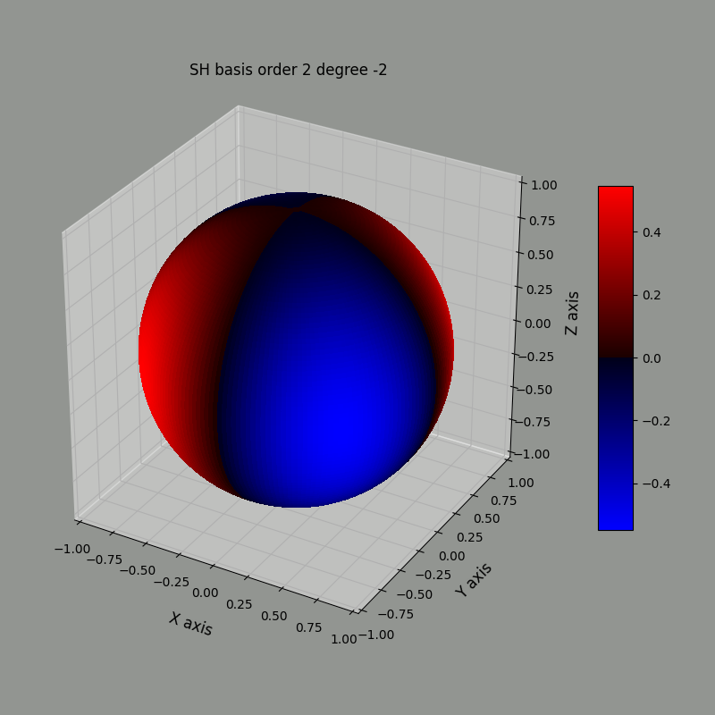
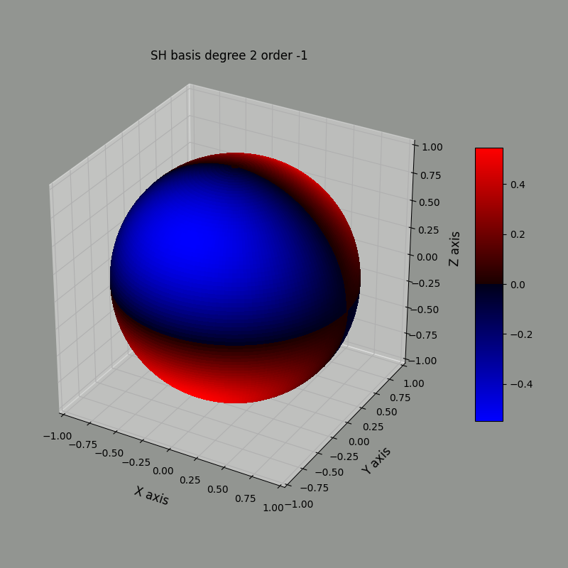
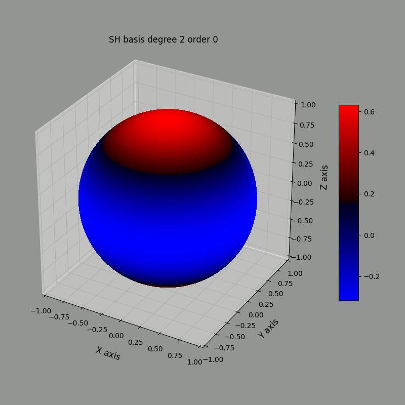
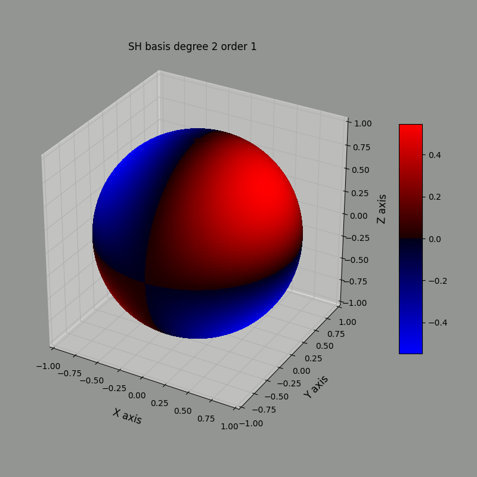
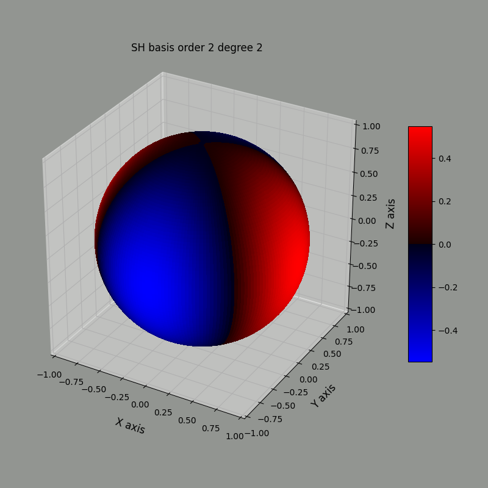

Using the radius method, we can represent the same basis functions this way:

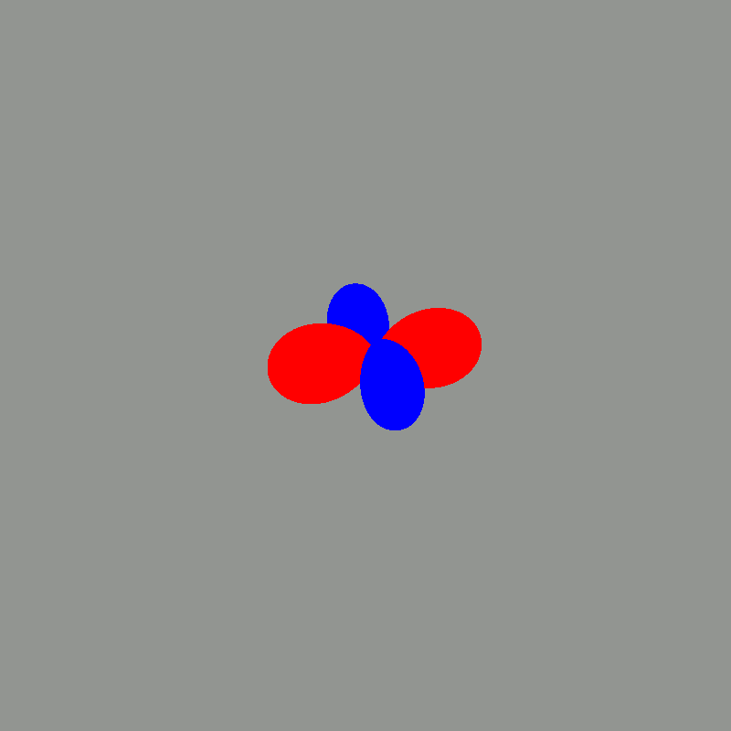
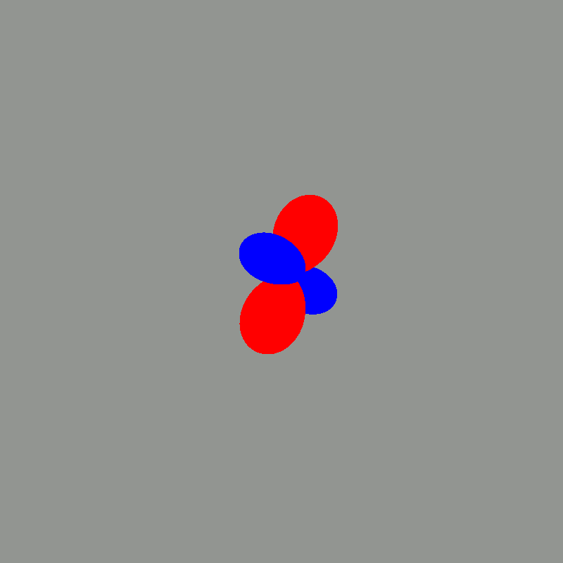
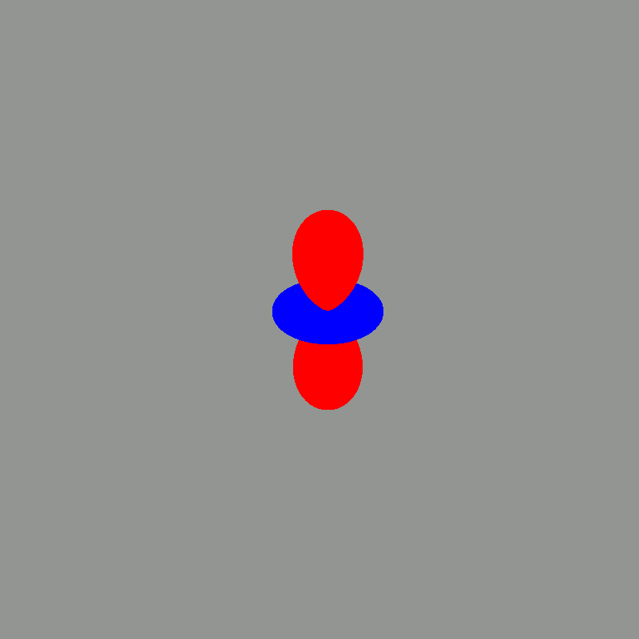
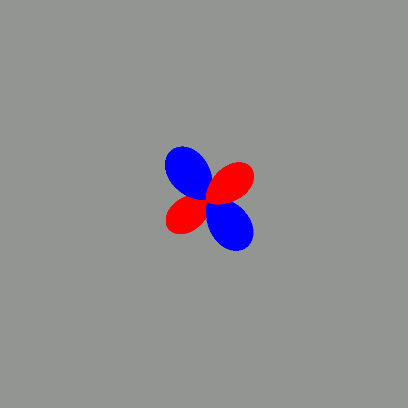
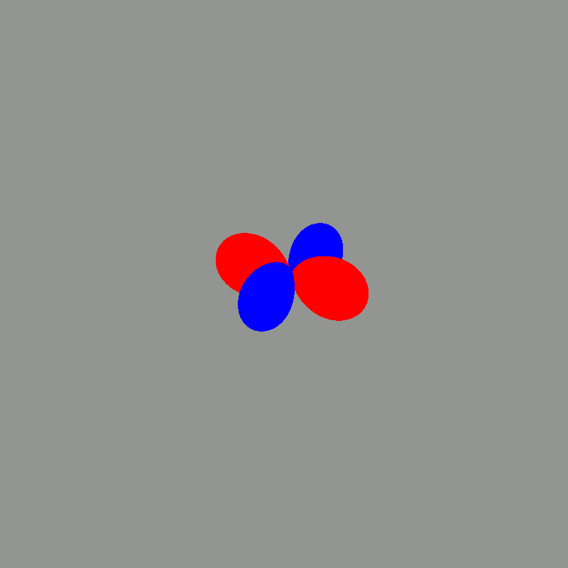

Notice that the blue and red regions match between both representation. 

To generate these images, I wrote some code to evaluate real spherical harmonics using a set of points on the sphere. The entire source code can be found in this [GitHub repository](https://github.com/Beatthezombie/SphericalHarmonicsFromScratch) and is written in Python. It supports up to $\ell=3$. It also contains Maple code which implements the associated Legendre polynomials, complex and real spherical harmonics to verify that the results match existing spherical harmonics tables.

# Tables 

Depending on the definition of Legendre polynomials and spherical harmonics, the basis functions might change somewhat. I will rely on the definitions used in the current and previous posts to compute the spherical harmonics basis functions.

The final equations will be in terms of cartesian coordinates $x, y, z$. To convert from spherical to cartesian coordinates we need these equations:

$$
\begin{align}

x &= r\sin\theta\cos\varphi \\
y &= r\sin\theta\sin\varphi \\
z &= r\cos\theta

\end{align}
$$

## Associated Legendre Polynomial 

$$
\begin{align}

P_{0}^{ 0} &= 1 \\
\\
P_{1}^{-1} &= -\frac{1}{2}\sqrt{1 - x^2} \\
P_{1}^{ 0} &= x \\
P_{1}^{ 1} &= \sqrt{1 - x^2} \\
\\
P_{2}^{-2} &= \frac{1}{8}(1-x^2) \\
P_{2}^{-1} &= -\frac{x}{2}\sqrt{1 - x^2} \\
P_{2}^{ 0} &= \frac{1}{2}(3x^2 -1) \\
P_{2}^{ 1} &= 3x\sqrt{x^2 - 1} \\
P_{2}^{ 2} &= 3(1-x^2)

\end{align}
$$

## Complex Spherical Harmonics 

$$
\begin{align}

Y_{0}^{ 0} &= \frac{1}{2}\sqrt{\frac{1}{\pi}} \\
\\
Y_{1}^{-1} &= \frac{1}{2}\sqrt{\frac{3}{2\pi}} \frac{(x-iy)}{r} \\
Y_{1}^{ 0} &= \frac{1}{2}\sqrt{\frac{3}{\pi}} \frac{z}{r} \\
Y_{1}^{ 1} &= -\frac{1}{2}\sqrt{\frac{3}{2\pi}} \frac{(x+iy)}{r} \\
\\
Y_{2}^{-2} &= \frac{1}{4}\sqrt{\frac{15}{2\pi}}\frac{(x-iy)^2}{r^2} \\
Y_{2}^{-1} &= \frac{1}{2}\sqrt{\frac{15}{2\pi}}\frac{z(x-iy)}{r^2} \\
Y_{2}^{ 0} &= \frac{1}{4}\sqrt{\frac{5}{\pi}}\frac{(2z^2-x^2-y^2)}{r^2} \\
Y_{2}^{ 1} &= -\frac{1}{2}\sqrt{\frac{15}{2\pi}}\frac{z(x+iy)}{r^2} \\
Y_{2}^{ 2} &= \frac{1}{4}\sqrt{\frac{15}{2\pi}}\frac{(x+iy)^2}{r^2}

\end{align}
$$

## Real Spherical Harmonics 

$$
\begin{align}

Y_{0,0} &= \frac{1}{2}\sqrt{\frac{1}{\pi}} \\
\\
Y_{1,-1} &= \sqrt{\frac{3}{4\pi}} \frac{y}{r} \\
Y_{1, 0} &= \sqrt{\frac{3}{4\pi}} \frac{z}{r} \\
Y_{1, 1} &= \sqrt{\frac{3}{4\pi}} \frac{x}{r} \\
\\
Y_{2,-2} &= \frac{1}{2}\sqrt{\frac{15}{\pi}}\frac{xy}{r^2} \\
Y_{2,-1} &= \frac{1}{2}\sqrt{\frac{15}{\pi}}\frac{yz}{r^2} \\
Y_{2, 0} &= \frac{1}{4}\sqrt{\frac{5}{\pi}}\frac{(2z^2-x^2-y^2)}{r^2} \\
Y_{2, 1} &= \frac{1}{2}\sqrt{\frac{15}{\pi}}\frac{xz}{r^2} \\
Y_{2, 2} &= \frac{1}{4}\sqrt{\frac{15}{\pi}}\frac{(x^2-y^2)}{r^2}

\end{align}
$$

# References
- [https://en.wikipedia.org/wiki/Spherical_harmonics]()
- [https://www.physics.uoguelph.ca/chapter-3-legendre-polynomials]()
- [https://www.physics.uoguelph.ca/chapter-4-spherical-harmonics]()
- [https://en.wikipedia.org/wiki/Table_of_spherical_harmonics]()
- [https://github.com/Beatthezombie/SphericalHarmonicsFromScratch]()
 

