

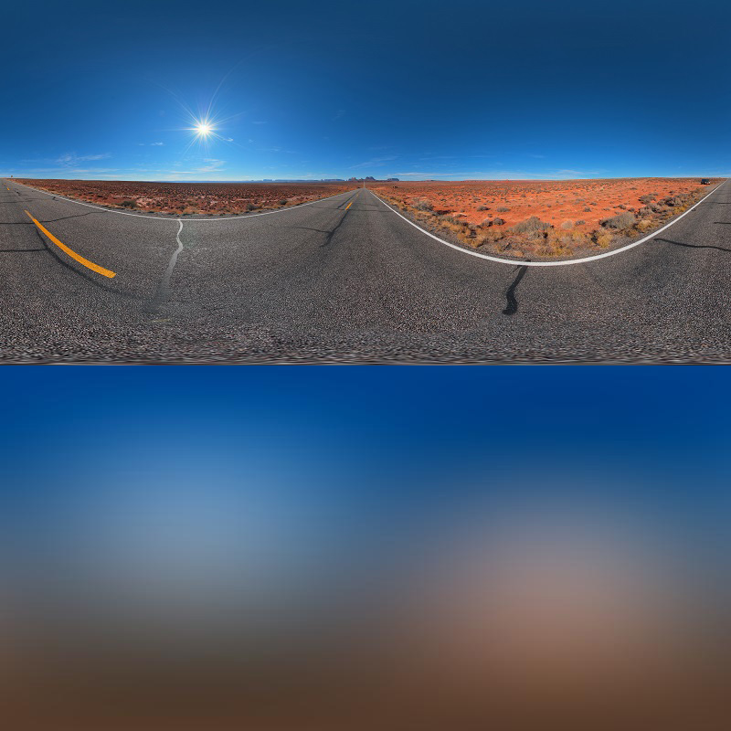

Approximation of environmental texture using real spherical harmonics of degree 2. 

$~$

*Disclaimer: This post is inspired from [XLGames' SH series](https://xlgames-inc.github.io/posts/sphericalharmonics1/) which has been taken down recently. It is available on the web archives.*

# Table of Contents

1. [Introduction](#summary)
2. [Computing Coefficients](#coeff)
3. [Approximation of Environmental Light](#envmap)
4. [Approximation of Lambertian Reflectance ](#lambert)
5. [Conclusion](#conclusion)
6. [Additional Example](#envmap2)
    1. [Environment Map](#envmapfactory)
    2. [Lambertian Diffuse Reflectance](#diffuse)

# Introduction 

In [Spherical Harmonics Part 1](https://beatthezombie.github.io/sh_post_1/) we defined the spherical harmonic basis functions and some of their properties. In this post we'll explore how to approximate environmental light using SH basis functions. The code for both the spherical harmonics approximation and Lambertian diffuse reflectance can be found [here](https://github.com/Beatthezombie/SphericalHarmonicsFromScratch).

In a static scene, we can summarize the incoming light at a point using an environmental map. We can think of an environmental map (or texture) as the result of placing a sphere in a scene, capturing light samples then projecting it to a 2D image. To get back the light coming from a specific direction, we just need to convert the direction into texture coordinates and sample it. If we want to compute what an object would look like in a scene with this lighting, we need to compute the rendering equation for all the samples combined with the different material models. For any real time application, evaluating this at runtime is too expensive as the number of light samples can quickly reach millions per pixel. In games, images like this are often use for high quality static reflection where only 1 of the samples is used when computing the reflected light. To apply it in a more general way, we need a better representation of the light samples.

One common approach is to use spherical harmonics to convert the environmental texture to a set of SH coefficients. It provides a significant space reduction while capturing the average lighting information. The downside is the loss of information when transforming from the image to spherical harmonics. We lose all the high-frequency details which makes it unsuitable for mirror-like reflections. To use the various material models like Blinn-Phong or Cook-Torrance we need to project them into SH basis then pass in the coefficients to obtain the material colors.

One example of SH lighting is in Halo 3. Bungie engineers projected the world geometry on a texture then used ray tracing to obtain light samples at every pixel of the texture. The resulting samples are then converted to SH coefficients, compressed and stored in a texture called a lightmap. At runtime, shaders have access to the texture coordinates of the lightmap and can sample it then pass it to the material models. For dynamic objects, SH coefficients are found by finding the closest sample available, be it a light probe, an object or the lightmap.

# Computing Coefficients 

To approximate a function $f(\theta, \varphi)$ which maps the surface of the sphere to $[-1, 1]$, we can use an infinite sum of real spherical harmonic basis functions multiplied by some coefficients $f_\ell^m$:

$$
f(\theta, \varphi) = \sum_{\ell = 0}^{\infty} \sum_{m=-\ell}^{\ell} f_\ell^m Y_{\ell, m}(\theta, \varphi)
$$

To obtain the coefficients, we use

$$
f_\ell^m = \int_0^{\pi} \int_0^{2 \pi} f(\theta, \varphi) Y_{\ell, m}(\theta, \varphi) \sin \theta d\theta d\varphi
$$

To prove this statement, we start with the approximation of $f$ and mulplity by $Y_{\ell', m'}$ for some $\ell'$ and $m'$. 

$$
f(\theta, \varphi)Y_{\ell', m'} = \sum_{\ell = 0}^{\infty} \sum_{m=-\ell}^{\ell} f_\ell^m Y_{\ell, m}Y_{\ell', m'}
$$

We then integrate over the surface of the sphere

$$
\int_0^{\pi} \int_0^{2 \pi} f(\theta, \varphi)Y_{\ell', m'} \sin \theta d\theta d\varphi= \int_0^{\pi} \int_0^{2 \pi}\sum_{\ell = 0}^{\infty} \sum_{m=-\ell}^{\ell} f_\ell^m Y_{\ell, m}Y_{\ell', m'} \sin \theta d\theta d\varphi
$$

After some simplifications:

$$
\int_0^{\pi} \int_0^{2 \pi} f(\theta, \varphi)Y_{\ell', m'} \sin \theta d\theta d\varphi= \sum_{\ell = 0}^{\infty} \sum_{m=-\ell}^{\ell} f_\ell^m \int_0^{\pi} \int_0^{2 \pi}Y_{\ell, m}Y_{\ell', m'} \sin \theta d\theta d\varphi
$$

We can use the orthonormality properties of spherical harmonics which means the integral on the right-hand side is always 0 except when $m =m'$ and $\ell = \ell'$ in which case it is 1 and we get back the formula to compute the coefficients:

$$
f_{\ell'}^{m'} = \int_0^{\pi} \int_0^{2 \pi} f(\theta, \varphi)Y_{\ell', m'} \sin \theta d\theta d\varphi
$$

If we want to approximate a function with SH of degree up to and including $\ell$, we need $(\ell + 1)^2$ coefficients. 

# Approximation of Environmental Light  

To find SH coefficients of an image, we need to use Riemann's sum on the double integral. The input image can be seen as having $\theta$ ranging from $0$ to $2\pi$ on the horizontal axis and $\varphi$ ranging from $0$ to $\pi$ on the vertical axis. We can divide this range by the number of pixels on each axis then compute the area covered by a single pixel.

$~$

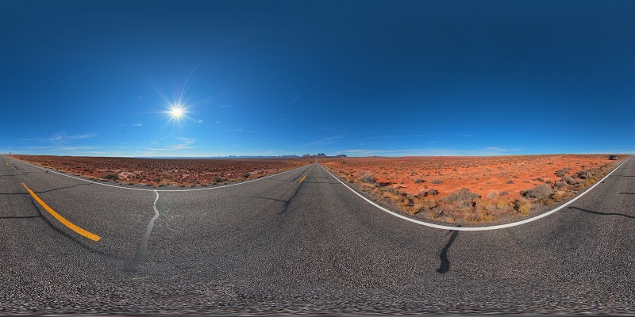

Environmental image from taken from http://www.hdrlabs.com/sibl/archive.html. 

$~$

If $w$ and $h$ are the number of pixels for the width and height respectively, the Riemann sum for the coefficients is:

$$
f_\ell^m = \frac{2\pi}{w} \frac{\pi}{h} \sum_{i=1}^w \sum_{j=1}^h  I(i,j) Y_{\ell, m}(\theta_i, \varphi_j) \sin \theta_i
$$

Where $I(i,j)$ is the image and $\theta_i$, $\varphi_j$ are angles corresponding to the pixels $i,j$. 

To visualize the result of the approximation, we need to evaluate the basis functions multiplied by the coefficients at every pixel on the images. Here's a comparison of degree 0, 1, 2 and 3 approximations:

 Degree 0 approximation 

$~$

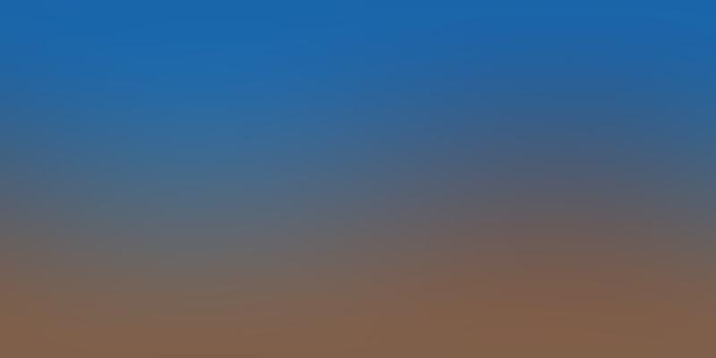

 Degree 1 approximation 

$~$

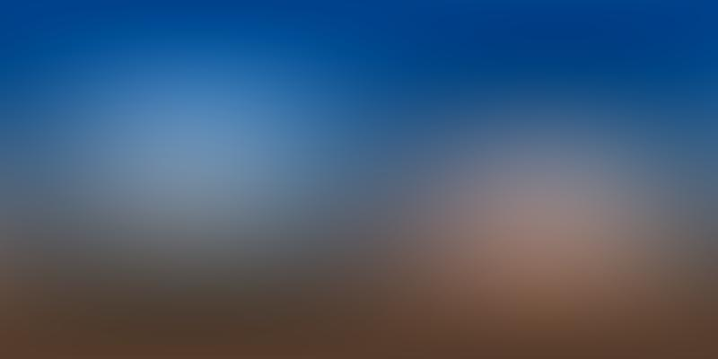

 Degree 2 approximation 

$~$

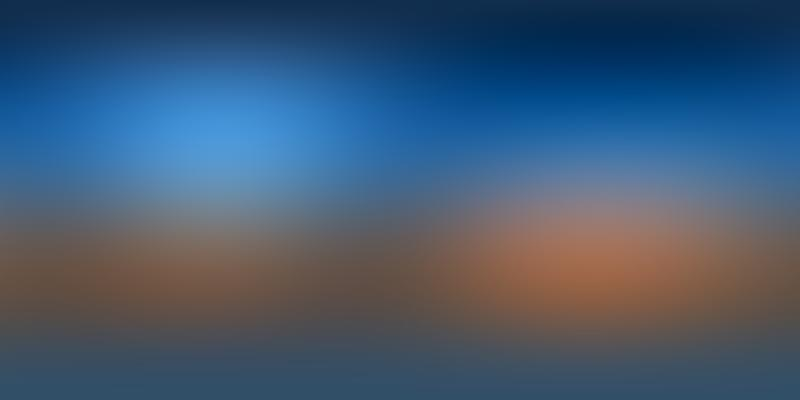

 Degree 3 approximation 

$~$

There is a clear loss of high-frequency details when using the approximation. Increasing the degree improves the fidelity but at the cost of having more coefficients. For example, if we want to use $\ell=3$ like the image above, we need 16 coefficients per color, for a total of 48 coefficients. 

# Approximation of Lambertian Reflectance 

Approximating directly the environment map summarizes the incoming light with a significant loss of details. If we instead compute the reflected light on a sphere given this environment map and store it in SH coefficients, we might obtain a function that is more suitable for approximation with SH coefficients.

If we consider each pixel in the environment map as a light ray oriented according to the normal of the sphere at its location, we can evaluate the Lambertian diffuse reflectance which is independent of the viewing angle. This can be summarized by the following equation for our textures:

$$
f_L(x, y) = \frac{\pi}{w} \frac{\pi}{h} \sum_{i=1}^w \sum_{j=1}^h  I(i,j) \max(\cos \alpha, 0) \sin \theta_i
$$

Where $f_L(x,y)$ is the Lambertian diffuse reflectance at pixel coordinates $x, y$, $\alpha$ is the angle between the light direction and the surface normal. $I(i, j)$ is the color from the image and $\sin \theta_i$ the Jacobian for spherical coordinates. Note that we only consider an hemisphere which is determined by $\max(\cos\alpha, 0)$.

Evaluating this equation at every point on the image gives the following result:

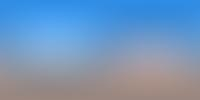

Lambertian diffuse reflectance computed from the environment map. 

$~$

This is much less detailed than the original image and we might just be able to produce a decent approximation using SH basis functions. The image below represent the approximation using SH basis functions from degree 0 to 3. Each image description contains the minimum, maximum and mean error. The error is measured by taking the absolute difference between the original image and its approximation per pixel with values ranging from 0 to 255.

$~$

 Degree 0 approximation. min = 0, max = 73, mean = 25.30

$~$

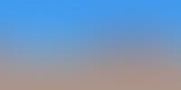

 Degree 1 approximation. min = 0, max = 23, mean = 8.04 

$~$

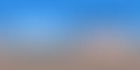

 Degree 2 approximation. min = 0, max = 9, mean = 2.21 

$~$

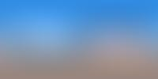

 Degree 3 approximation. min = 0, max = 9, mean = 2.36

$~$

# Conclusion 

In summary, we can use spherical harmonics to approximate environmental textures and compress it significantly. The downside is a loss of high-frequency details. This trade-off might be worth it in games where this approximation can provide more realistic lighting. In the special case where we store the reflected light using the Lambertian diffuse model, the SH approximation of degree 2 and higher is often able to produce a very accurate approximation with a low memory footprint. 

# Additional Example  

## Environment Map 

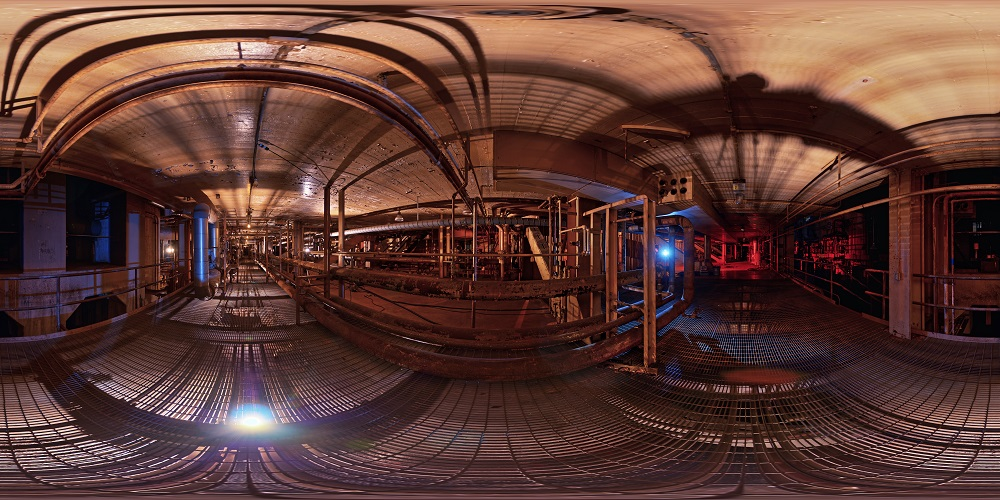

Taken from http://www.hdrlabs.com/sibl/archive.html. 

$~$

 Degree 0 approximation 

$~$

 Degree 1 approximation 

$~$

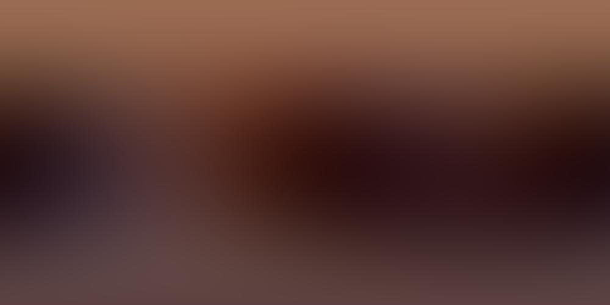

 Degree 2 approximation 

$~$

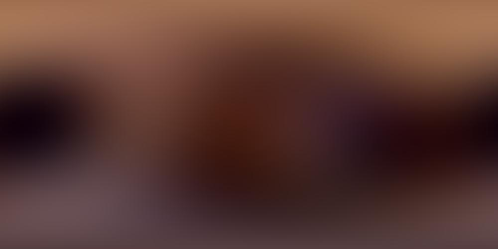

 Degree 3 approximation 

$~$

## Lambertian Diffuse Reflectance 

Lambertian diffuse reflectance computed from the environment map. 

$~$

 Degree 0 approximation 

$~$

 Degree 1 approximation 

$~$

 Degree 2 approximation 

$~$

 Degree 3 approximation 

$~$

# References
- [https://en.wikipedia.org/wiki/Spherical_harmonics]()
- [https://www.gdcvault.com/play/253/Lighting-and-Material-of-HALO]()
- [http://www.hdrlabs.com/sibl/archive.html]()
- [https://github.com/Beatthezombie/SphericalHarmonicsFromScratch]()
- [https://en.wikipedia.org/wiki/Lambertian_reflectance]()
- [https://www.ppsloan.org/publications/StupidSH36.pdf]()

